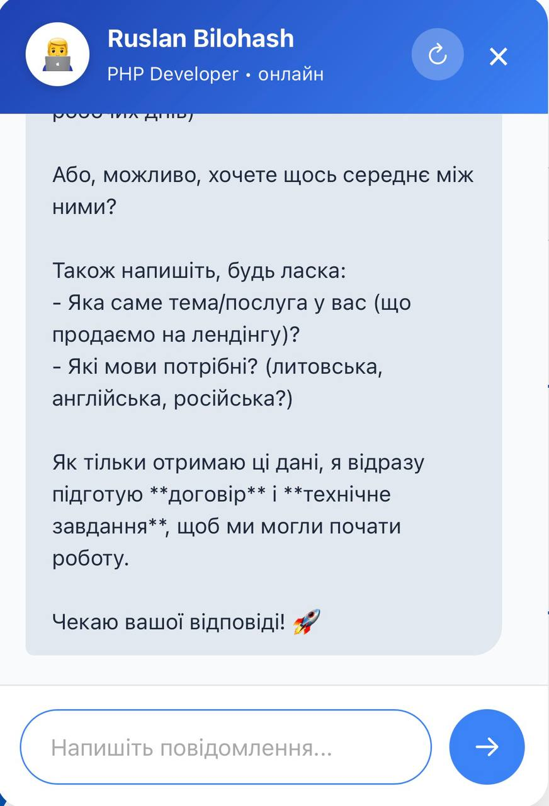

# 💬 Bilohash AI Consultant Chatbot


**Розумний чат-бот-консультант** для сайтів на базі **Grok xAI** з інтеграцією Telegram, адмін-панеллю та автоматичним збором контактів.


---

## 🌍 Виберіть мову / Choose language

| Мова          | Прапор                  | Посилання |
|---------------|-------------------------|---------|
| **English**   | 🇬🇧🇺🇸🇨🇦               | [English ↓](#english) |
| **Norsk**     | 🇳🇴                     | [Norsk ↓](#norsk) |
| **Українська**| 🇺🇦                     | [Українська ↓](#українська) |
| **Русский**   | 🇷🇺🇺🇦🇧🇾               | [Русский ↓](#русский) |

---

### 🇬🇧 **English**

**Modern AI Consultant Chatbot** for websites.

**Features:**
- Powered by Grok xAI (most truthful and fast AI in 2026)
- Instant notifications to your Telegram
- Reply directly from Telegram or built-in Admin Panel
- Automatically asks for client's name and contacts (phone, email, Telegram, WhatsApp, Viber)
- Beautiful floating widget with no flickering
- Full admin panel with real-time chat history
- Multi-language support (detects browser language)

**Perfect for:** freelancers, developers, agencies, consultants.

---

### 🇳🇴 **Norsk**

**Moderne AI-konsulent chatbot** for nettsteder.

**Funksjoner:**
- Drevet av Grok xAI
- Øyeblikkelige varsler til din Telegram
- Svar direkte fra Telegram eller admin-panel
- Spør automatisk om navn og kontaktinformasjon
- Pen flytende widget uten blinking
- Full admin-panel med sanntidshistorikk

---

### 🇺🇦 **Українська**

**Розумний AI-чатбот консультант** для сайтів.

**Можливості:**
- Працює на Grok xAI (найправдивіший ШІ 2026 року)
- Миттєві сповіщення у ваш Telegram
- Відповіді прямо з Telegram або зручної адмін-панелі
- Автоматично запитує ім'я та контакти (телефон, email, Telegram, WhatsApp, Viber)
- Красивий плаваючий віджет без миготіння
- Повноцінна адмін-панель з історією всіх чатів
- Автовизначення мови браузера

**Ідеально підходить** для фрілансерів, розробників, агентств та консультантів.

---

### 🇷🇺 **Русский**

**Умный AI-чатбот консультант** для сайтов.

**Возможности:**
- Работает на Grok xAI
- Мгновенные уведомления в Telegram
- Ответы прямо из Telegram или из удобной админ-панели
- Автоматически спрашивает имя и контакты (телефон, email, Telegram, WhatsApp, Viber)
- Красивый плавающий виджет без мерцания
- Полноценная админ-панель с историей всех чатов

---

## 🚀 Інструкція з налаштування (Installation)

### 1. Завантажте файли
Скопіюйте всі файли в корінь вашого сайту:
- `chat-widget.js`
- `bot.php`
- `get-messages.php`
- `telegram-webhook.php`
- `admin.php`
- `config.php`

### 2. Налаштуйте `config.php`

Відкрийте файл `config.php` і заповніть:

```php
define('TELEGRAM_TOKEN',     '8344613173:AAEY7mnVx5Z4H8LovTmm-uj5s81-PS5--JA');
define('YOUR_TELEGRAM_CHAT_ID', 5351698956);   // ваш chat_id
define('GROK_MODEL', 'grok-4.20-0309-non-reasoning');
вставте на сторінку - paste page: <script src="/chat-widget.js" defer></script>
